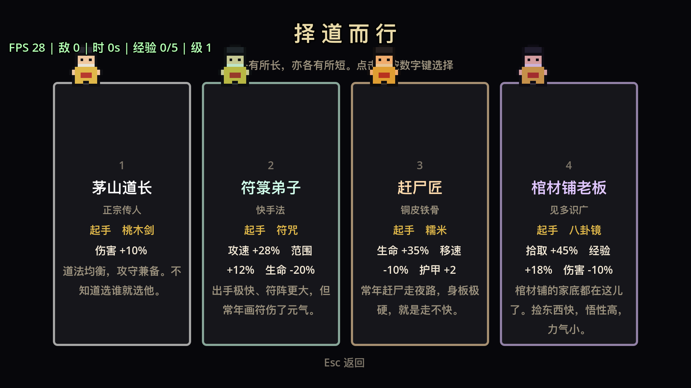

我一直想做一个自己的游戏，但每次都在「先学美术」这一步卡住。这次换了个做法：**代码全部交给 AI 写，我只负责定方向和验收**，用一个完整项目来学游戏开发。

题材选了港片僵尸——那是民俗元素，没有版权风险。引擎选了 Godot 4，因为它的 2D 工作流干净、GDScript 学习成本低、而且导出 Windows 构建只要点两下。

结果比我预期好：现在有一个能完整玩的游戏、能上架的构建、和 20 张商店截图。而这个过程里真正有价值的部分，是**AI 犯过的那些错**。



## 这个项目现在做成了什么

先摆事实，避免自夸：

| 维度 | 现状 |
| --- | --- |
| 代码 | 52 个 GDScript 文件、16039 行；测试脚本单独 3502 行 |
| 内容 | 8 把基础武器 + 8 个进化形态、11 种普通敌人 + 2 个 Boss、4 个可选角色、7 项永久强化 |
| 美术 | 35 张程序化生成的占位精灵（字符画 + 调色板，运行时合成贴图） |
| 音效 | 16 个程序化合成的音效（波形合成，零音频文件） |
| 自动化验证 | 19 组自动验证、271 处断言 |
| 性能 | 800 个同屏敌人 → 帧时间 0.71 毫秒（约 1400 FPS），占 60fps 预算的 4% |
| 稳定性 | 30 分钟连续运行：49618 击杀、内存增长 1.2%、节点数有界 |
| 交付 | Windows 构建 100MB（exe + 13MB 数据包）、Linux 构建、7 张商店宣传图、20 张 1920x1080 截图 |

一局游戏的实测曲线（固定种子，4 分钟）：

| 时间 | 击杀 | 同屏敌人 | 等级 |
| --- | --- | --- | --- |
| 30s | 27 | 9 | 3 |
| 60s | 66 | 17 | 6 |
| 120s | 217 | 51 | 12 |
| 180s | 506 | 106 | 20 |
| 240s | 1072 | 256 | 26 |

**「同屏敌人」那一列是这类游戏的生命线。** 它必须是平滑的加速曲线：早早顶到上限说明生成太快（玩家被推着走），4 分钟还只有几十只说明生成太慢（后期没压力，无聊）。


这张图鉴是专门为「可辨识度」做的一个工具，后面会讲到它抓出的问题。

## 几个定下全局的架构决策

### 敌人完全不用物理引擎

Godot 的物理引擎很方便，但几百个 `CharacterBody2D` 互相碰撞的开销很可观。这里的做法是**只有玩家一个是物理体**（成本为零），敌人全是裸 `Node2D`，位置自己算，碰撞判定自己写空间哈希网格。

这个决定后面带来了一系列好处：敌人的分离力可以按帧分摊、投射物不用 `Area2D`、网格查询能一次拿到一圈邻居。800 个敌人的实测帧时间是 0.71 毫秒。

反过来说，如果一开始用了物理引擎，后期想换掉它几乎等于重写。

### 一切数据驱动

武器、敌人、被动、角色、元强化全都是数据表，代码只读表。加一种敌人要改的是一个 `.tres` 资源文件，不是代码：

```
scripts/enemies/enemy.gd          # 一个 Enemy 类，行为由数据决定
resources/enemies/jiangshi.tres   # 跳尸：血 14、速 24、权重 4.0、20 秒后出现
resources/enemies/coffin_guest.tres  # 棺中客：movement_mode = "ambush"
```

最直接的证据是「棺中客」这个敌人：它是路边一口棺材，玩家走近才开盖起身。这个机制在代码里只对应 `EnemyStats` 加了三个字段（触发半径、自动起身时间、是否刷在视野内），加一个 `movement_mode` 分支。**没动任何已有代码。**

### 系统之间靠信号解耦

所有跨系统通信走一个 `GameEvents` 单例信号总线。武器不知道 HUD 存在，HUD 不知道武器存在。这带来一个具体好处：加「武器进化」这个功能时，武器管理器只要多发一个事件，UI 那边不用改。

### 占位美术是程序化生成的

零美术成本就能看到完整游戏。做法是「ASCII 字符画 + 调色板」在运行时合成贴图：

```
"jiangshi": {
    "pivot": Vector2i(8, 15),
    "rows": [
        ".......RR.......",
        "....KKKKKKKK....",
        "...KPPPEEPPPK...",   # E 是额头上那张黄符
        "KKKKKKKKKKKKKKKK",   # 双臂平伸，僵尸片的招牌姿势
        "..KKKBBBBBBKKK..",
    ],
},
```

好处有三个：改角色长相不用会画画；想改剪影直接改字符；后期换正式美术时只要改 `get_texture()` 一处，游戏逻辑完全不动。

## 19 轮迭代里最值得记的九个坑

我把它们按「发现的难度」排序，而不是按修起来的难度——**发现才是贵的那一步**。

| 坑 | 表面现象 | 真实原因 |
| --- | --- | --- |
| 装饰层节点泄漏 | 30 分钟内存缓慢上涨 | 只存了装饰物、没存同格的地面贴片，贴片永不释放 |
| 经验提款机 | 4 分钟等级从 30 跳到 36 | 新敌人经验配得高，而且它永远死在玩家脚边，香火必被捡走 |
| 压力控制器读错输入 | 同屏人数顶到上限 429 | 控制器被放在刷怪分支里，实际读的是几分钟前的旧人数 |
| 报表口径混用 | 回收率算出 78%（真实 97%） | 一个字典被两处赋值，击杀来自死亡时刻、经验来自被污染的快照 |
| 一条永远为真的断言 | 测试全绿 | 取快照时玩家已经被重开成了新角色，比较的是两组无关数据 |
| 工具腐烂 | 需要它时才发现坏了 | 基准测试不在主测试套件里，加选角界面后它坏了好几个版本 |
| 瞄准偏移 | 命中率只有 25% | 发射方向从脚底算，而投射物从胸口生成 |
| 百分比加成无效 | 护甲类强化完全不生效 | 百分比加成作用在基础值 0 上，永远是 0，需要单独的「固定值」通道 |
| 双重召唤 | Boss 召唤数量翻倍 | 把召唤逻辑从 Boss 下移到基类时，子类残留了一份同名处理 |

挑四个展开，因为它们各自代表一类完全不同的失败方式。

### 静默失效：装饰层的节点泄漏

地面上的草丛、墓碑、碎石是「按格子哈希撒上去」的，玩家走动时动态生成和回收。代码看起来没问题，但 30 分钟稳定性测试跑出来的数字很吓人：

```
节点数   332（开局） → 24205（30 分钟后）
内存     稳态持续上涨
```

原因是同一个格子里有「地面贴片」和「装饰物」两种东西，回收时只把装饰物放回了池子，地面贴片被漏掉了。修法是把每个格子存成一个数组，两种东西一起收。

这件事的教训不在于这个 bug 本身，而在于**它是稳定性测试发现的，不是任何单元测试发现的**——单点逻辑全是对的，只有时间维度上才暴露。所以这个项目后来一直保留着一个 30 分钟的长时间测试。

### 推理听起来很顺，但实测直接推翻：镜中鬼

这是我（AI）犯的最有代表性的一次错误，值得完整讲。

我想要一个「惩罚绕圈跑」的敌人。设计声明写得很顺：让一个新敌人不追你**现在**的位置，而是追你 **1.1 秒之前**的位置；它可以比你快，但直线跑依然甩得掉（因为它锁定的那个点也在前进，间距会稳定下来）；可你一旦**绕圈**，它就会走弦线切进来，一圈比一圈近。

推理没问题，代码也没写错。我还为它写了一个模拟测试：同一套几何起点，只把玩家的路径从直线换成绕圈，跑 25 秒比最后的距离。

实测结果：

```
直线跑 25 秒后距离    99 像素
绕圈跑 25 秒后距离    85 像素      ← 只差 14 像素
```

**为什么推理错了。** 只要玩家在动，它最终会停在「过期目标点」上，于是它到玩家的距离就等于**玩家在过去 1.1 秒所走路径的弦长**：

```
直线：          78 × 1.1 = 86 像素
半径 120 的圆： 2 × 120 × sin(0.65 × 1.1 / 2) = 84 像素
```

弦长几乎不受路径形状影响。这个声明从头到尾就是假的，而它在游戏里**不会产生任何报错**——只会表现为「这个敌人好像没什么存在感」，玩家说不出来，我也测不出来。

修正的办法是**先量、再改声明**。量完发现它真正在做的事是另一件很有价值的事——**它是全场唯一甩不掉的追击者**：

| 跑 25 秒直线 | 结束时离玩家 |
| --- | --- |
| 镜中鬼 | 99 像素 |
| 跳尸（普通追击敌人） | 1725 像素 |

差距 17 倍。普通追击敌人都比你慢（跳尸 24、玩家 78），所以「一直跑」就能永远甩掉它们；而它的间距会稳定在约 86 像素——你跑多久它都还在旁边。它真正惩罚的是**往回跑**。

**机制能跑起来，不等于它起到了你想要的作用。这两件事必须分开验证。**

### 加内容顺手打断了平衡：经验提款机

镜中鬼加完之后，测试报表里的同屏敌人峰值从 384 掉到 103。差得太多，于是做了对照实验（把它的刷新权重设为 0），确认是它造成的：

| 4 分钟一局 | 不加 | 加了（第一版） | 变化 |
| --- | --- | --- | --- |
| 击杀 | 1159 | 1107 | ↓4% |
| 掉落经验 | 2668 | 3965 | ↑49% |
| **每击杀经验** | **2.30** | **3.58** | **↑56%** |
| **等级** | **30** | **36** | **↑20%** |
| 同屏敌人峰值 | 337 | **103** | **↓69%** |

读法：击杀数**下降**了，经验总量却**上升**了，说明每次击杀的经验涨了 56%。原因两个，都和「它永远待在玩家旁边」直接相关：

1. 它的经验值配了 7，而跳尸只有 3。它把刷出来的低级杂兵**替换**掉了，等于悄悄抬高整池的平均经验。
2. 它死在玩家脚边，香火**必然被立刻捡走**，一点都不会因为漂移浪费。

结果是它变成了一台**经验提款机**：玩家 4 分钟到 36 级而不是 30 级，武器变强之后敌人几乎瞬间融化，同屏数量崩到 103——「尸潮压境」这个核心体验被削掉了六成。

修法对着根因去：经验值 7 → 3（和跳尸持平），刷新权重 1.0 → 0.45。调完回到 27 级 / 峰值 438。

**这个 bug 不报错、不崩溃、测试全绿，玩起来也「感觉没问题」**——玩家只会觉得「这局怎么清得这么快」。只有把整局数据前后对比才看得见。

### 反馈控制器读错了输入

生成器原本的刷新速率**完全由时间决定**。这有个结构性缺陷：玩家清怪速度一旦超过刷新速度，同屏人数就永远涨不起来，屏幕变空。

所以我加了一个反馈控制器：每 0.5 秒看一眼实际同屏人数，低于目标就加快刷新。结果它把压力推到 1.46，而同屏人数早就顶到上限 429 了——方向完全反了。

根因是**它读错了输入**：我把它和刷怪逻辑放在一起，于是它每 0.5~1.5 秒才被调用一次，而传进去的时间增量仍然只是单帧的 16 毫秒。内部的指数平滑几乎不动，那个「平均人数」一直停在**开局时记下的值**。

```
一个反馈控制器读错输入，比没有控制器更糟：
它有权威，却做了错误的事。
```

修完之后又踩了第二层：我把目标抬高 31%，压力却涨了 3.5 倍、击杀涨了 63%。原因是「压力 → 同屏人数」这个环节本身很陡，回路是**病态**的；更麻烦的是正反馈——控制器把人数钉住之后，玩家 DPS 的任何提升都会直接变成更多击杀、更多经验、更高 DPS。

最后的结论是：**病态的被控对象不能靠调增益救。** 放弃「精确钉住目标人数」，把控制器权限收窄到 0.7~1.5 倍，只兜底两件事——玩家清不动时刷慢点，玩家太强时多刷点。主曲线仍由时间决定，因为那是设计师能预期、也能向玩家解释的部分。

## AI 协作开发：它擅长什么，它一直在犯什么错

这一节可能是这篇复盘里最有用的部分。我不是在评价 AI 的能力，而是在总结**怎么用它才不会自欺**。

### 它做得比人好的事

- **把「验证」当成默认动作。** 每加一种敌人或武器，它会顺手把数据完整性、精灵存在性、静默失效组合全查一遍。人做这个会烦，它不会。
- **主动加仪表。** 报表里那些「同屏峰值 / 等级 / 每击杀经验 / 自适应上限 / 压力倍率」不是一开始就有的，是它为了排查问题一个个加上去的，而且加完之后**留在那里**了。
- **扫式重构。** 把召唤逻辑从 Boss 下移到敌人基类这种改动，涉及多个文件、多个调用点，它做得又快又不容易漏（虽然也漏过一次，见上表最后一行）。
- **把理由写进注释。** 这个项目里几乎每个非显然的决定都带着一段「为什么这么做」和「我踩过什么坑」。人写代码时很少这么啰嗦，但这对后来者（包括三个月后的自己）价值极高。

### 它反复犯的三类错

1. **先推理后测量。** 镜中鬼那次是典型：推理很顺，于是就把设计声明当成了事实写进文档。它后来学到的规矩是——**任何设计声明，写进文档之前必须先量一遍**。
2. **擅自扩大范围。** 我说「给它更多权限」，它就把参考线抬到 219、下限放到 0.55，一次改了两个变量，结果整个平衡跑飞。**一次只改一个变量**这条规矩，AI 需要被明确约束才会遵守。
3. **写不会失败的测试。** 最典型的是一条「武器有没有升级」的断言：它取快照的时机太晚，那时玩家已经被别的测试重开成了新角色，于是比较的是两组无关数据，**断言永远为真**。一条永远通过的断言比没有断言更糟——它会让人以为这个方向已经被覆盖了。

顺带说，它还犯过三次同一个低级错误：在 GDScript 字符串里嵌了 ASCII 双引号导致解析失败。到第三次的时候它自己写下了一句话：「同一个错误犯到第三次，问题就不是粗心，是工具选错了。」

### 人必须做的事

- **定方向、否决范围。** AI 不会拒绝你，所以「不加了」必须由人来说。
- **玩游戏。** 这一条无法外包。AI 能测出「同屏 258 个敌人时帧率多少」「每击杀经验 2.26」，但测不出**好不好玩**。所有设计问题最终都要靠人的体感来判定，而人的反馈往往是模糊的（「第 4 分钟开始无聊」）——但模糊的反馈恰好最有价值，因为它指向设计，而设计问题用指标测不出来。
- **要求它先量再说。** 这是唯一一条能同时防住上面三类错误的要求。

## 一套可复制的实测方法

这个项目最值钱的沉淀不是代码，是下面这五条。它们都是被踩出来的。

### 一、固定种子 + 基线表

所有测试都设固定随机种子，于是「同一份代码跑出来的是同一局」。基线表长这样：

```
   30s │ 击杀   27 │ 同屏   9 │ 等级  3 │ 武器 1 把
   60s │ 击杀   66 │ 同屏  17 │ 等级  6 │ 武器 2 把
  120s │ 击杀  217 │ 同屏  51 │ 等级 12 │ 武器 4 把
  240s │ 击杀 1072 │ 同屏 256 │ 等级 26 │ 武器 4 把
```

但要加一条警告：**这张表只在「当前内容」下有意义，不能跨版本直接比较。** 每加一种敌人，它的生成会消耗随机数，整局的随机流就整体错位了——跑出来的是**另一局**，不是同一局的微调。正确用法是「和同一版本内的其他改动比」，以及看**趋势形状**。

### 二、对照实验：把变量设成 0

怀疑某个新东西破坏了平衡时，最省事的办法是把它**关掉**再跑一遍：武器就把冷却设成 999 秒，敌人就把刷新权重设成 0。上面「经验提款机」和「不是墨斗线导致的」两个结论都是这么来的。

**千万不要靠读代码推理因果。** 这个项目里有三次我以为是 A，对照实验证明是 B。

### 三、新写的断言，必须验证它真的会失败

这条规矩救过很多次。具体做法是：写完断言后，**故意把被测的东西改坏一次**，确认断言报警。

比如守「每把基础武器都必须有进化形态」这条规则时，我删掉五雷符的进化配方，断言立刻报：

```
武器数据验证：这些基础武器没有进化形态 → 五雷符(thunder_talisman)
```

还有一次，我为「同屏人数会不会失控」写了个断言，验证方式是把反馈方向反过来（人多反而加快刷新），三条断言同时报警并各自指出了问题。

**没见过失败的测试，不算测试。**

### 四、一次只改一个变量

这条听起来像废话，但 AI 特别容易违反。上面压力控制器那次就是同时改了参考线和下限两个数，导致无法归因。

### 五、口径必须唯一

「报表里的数字来自两个不同的测量点」那次，表面上只是数字对不上（2.12 vs 2.45），实际是同一个字典被两处赋值：击杀来自玩家死亡那一刻（包含自动化测试杀的 Boss），经验来自事后又一次快照（同样被污染）。污染量是 149 次击杀、710 点经验，连「香火回收率」都被算成了 78%，而真实值是 97%。

修法是把两个口径拆成两个变量，名字上就标清楚谁是谁。**一个变量只承担一个口径**——混用之后数值看起来都「差不多对」，你只会觉得「哪里怪怪的」，却定位不到。

## 版权与素材边界：《僵尸先生》哪些能用、哪些不能

这一节必须写清楚，因为很容易踩线。

**不能用的**（都受版权保护）：

- 片名《僵尸先生》以及任何续集名称
- 电影里的角色名、演员形象、剧照、海报
- 电影配乐、主题曲、以及任何可识别的旋律

**可以用的**（都是民俗元素，不受版权保护）：

- 僵尸（跳尸）的设定：双臂前伸、双脚并跳
- 符咒、桃木剑、糯米、八卦镜、墨斗线、纸人、纸扎童、鬼火、养尸人、棺中客、旱魃
- 「道士用民俗法器对付僵尸」这个通用框架

这个项目的做法是：只借民俗元素，**所有命名、美术、音效、文案全部原创**。工作标题是《茅山夜行》，角色是「茅山道长 / 符箓弟子 / 赶尸人 / 棺材匠」这类通用称谓，不指向任何具体的电影角色。

还有一条容易忽略的：**字体授权**。项目里打包的字体是 Noto Sans SC（OFL 授权，允许商用再分发，但**必须随包附上 OFL.txt**）。而微软雅黑、苹方、方正系列都**不能**随游戏分发——这是独立开发者最常踩的法律坑之一。

## Steam 上架进度

已经完成的：

- **Windows 构建**：100MB 的 exe + 13MB 数据包，已用导出的数据包实际启动验证过
- **Linux 构建**：68MB，同样验证过
- **商店素材**：7 张宣传图（全部是 Steam 要求的精确尺寸）+ 20 张 1920x1080 截图
- **上架清单文档**：从账号注册到 steamcmd 上传的步骤

还差的：

- **预告片**（需要有真实游玩的素材，而这件事的前提是游戏已经好玩到值得录）
- **真机测试**：目前所有性能数据都来自开发机（M4 Pro），需要在一台普通 Windows 机器上验证
- **Steamworks 账号与商店页上传**：这部分必须由人操作

## 下一步

我给自己定的下一步不是加内容，而是**把这个游戏认真玩十局**。

原因是这次复盘里最重要的那条结论：**AI 能测的东西和「游戏好不好玩」之间，隔着一道它永远跨不过的墙。** 现在这个项目有 19 组自动验证、271 处断言、30 分钟的稳定性测试，覆盖了几乎所有的**正确性**——但一局游戏到底爽不爽，只有人能回答。

如果玩完之后发现核心手感不对，那么加第 17 把武器只是在错误的方向上堆量。

---

这个项目的所有技术文档都在仓库的 `docs/` 下（游戏设计、学习路线、数值调优指南、上架清单、商店文案），代码注释里也保留了每一次踩坑的推理过程。如果你也在用 AI 做项目，我建议先看 `docs/03-数值调优指南.md` 里那节「脚本悄悄腐烂」——它讲的是一件跟代码质量无关、但几乎每个项目都会中的事。
